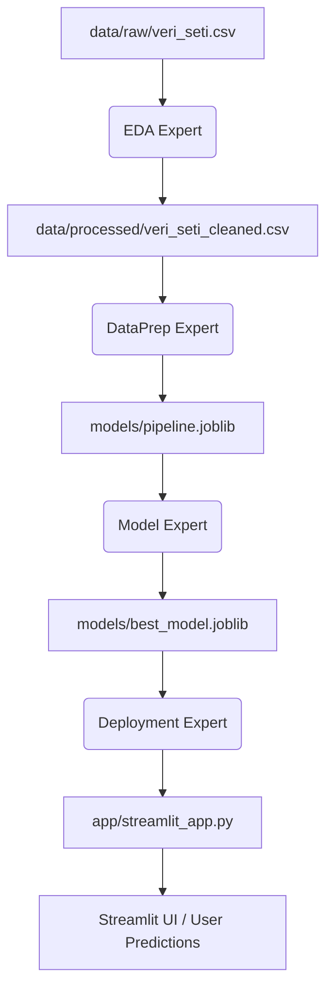

# 💼 İK Çalışan İstifa (Churn) Tahmini ve Karar Destek Sistemi

Bu proje, şirket çalışanlarının istifa riskini önceden tahmin etmek ve İK elde tutma bütçesini en verimli şekilde dağıtmak amacıyla **CRISP-DM** metodolojisi temel alınarak geliştirilmiş uçtan uca bir makine öğrenmesi ve ürünleştirme (deployment) çalışmasıdır.

---

## 🎯 Proje Vizyonu ve İş Değeri
- **İş Problemi:** Her çalışanın şirketten ayrılması (istifa/emeklilik) işe alım maliyetleri ve verimlilik kaybı nedeniyle ortalama **$15,000** zarar oluşturmaktadır.
- **Çözüm:** İstifa riskini önceden tahmin edip İK departmanına erken aksiyon şansı tanımak. İK her yüksek riskli çalışana **$3,000** elde tutma bütçesi (prim, terfi, rotasyon) ayırarak, bu kişileri %80 olasılıkla şirkette tutabilir.
- **Başarı Kriteri:** Ayrılacak kişileri mümkün olduğunca kaçırmayan (**Recall odaklı**) ve bütçe verimliliğini koruyan en doğru modeli seçmek.

### 📖 Veri Hikayesi (Data Story)
*   **Veri Kaynağı:** Şirket İK veritabanından alınan boylamsal panel veri yapısı (49,653 satır). Her çalışanın demografik, kıdem, departman, unvan ve istifa durumu gibi boylamsal geçmiş kayıtlarını barındırır.
*   **Gerçek İhtiyaç:** Hangi çalışanların istifa riskinin yüksek olduğunu öngörememek, İK'nın kısıtlı bütçeleri verimsiz/rastgele dağıtmasına neden olmaktadır.
*   **Önemi:** Şirketin entelektüel sermayesini (kurumsal hafızasını) korumak, departman içi verimlilik kayıplarını engellemek ve yıllık milyon dolarlık işgücü kayıp maliyetini veri destekli kararlarla önlemektir.

### 👥 Ekip Rolleri & Sorumluluklar
*   **HR Director (Proje Sponsoru):** İş probleminin tanımlanması, İK elde tutma bütçesinin yönetimi ve elde tutma aksiyonlarının koordinasyonu.
*   **Veri Bilimci ():** Veri temizleme, keşifsel analiz (EDA), grup tabanlı split tasarımı ve veri sızıntısının engellenmesi.
*   **ML Mühendisi:** 10 farklı modelin eğitimi, çapraz doğrulama (CV), hiperparametre optimizasyonu ve modellerin `.joblib` formatında paketlenmesi.
*   **Arayüz & Raporlama Geliştirici:** Streamlit tabanlı çalışan karar destek arayüzünün yazılması ve PDF final raporlama altyapısının kurulması.

### ⚖️ Karar Değeri ve Sınırlılıklar
*   **Desteklenen Karar:** Modelin ürettiği risk skoru İK'nın hangi çalışana eylem alacağı (prim, terfi, rotasyon) kararını belirler.
*   **Sınırlılıklar:**
    1. Model geçmiş verilere dayalıdır, ani makroekonomik krizler veya kişisel özel durumlar (sağlık vb.) veride kodlu olmadığı için tahmin edilemeyebilir.
    2. Panel verideki zaman değişkeni (STATUS_YEAR) modelin güncel kalmasını gerektirir, bu yüzden yılda en az 1 kez retraining (yeniden eğitim) şarttır.

## 📦 Proje Teslim Paketi (Delivery Checklist)

Rubriğe uygun olarak hazırlanan teslim bileşenleri ve konumları:

1. **Analitik Rapor (Kriter 1 & 5):** İş problemi, CRISP-DM süreçleri, finansal analizler ve karar önerilerini içeren PDF rapor: [report.pdf](report.pdf)
2. **Notebook Dosyası (Kriter 2 & 3):** Plotly görselleri ve veri analisti yorumlarıyla zenginleştirilmiş, tekrar çalıştırılabilir defter: [notebooks/final_analysis.ipynb](notebooks/final_analysis.ipynb)
3. **Çalışan Prototip (Kriter 6):** Tekil/toplu risk tahmini ve İK eylem tavsiyeleri üreten web uygulaması: [app/streamlit_app.py](app/streamlit_app.py)
4. **Model Dosyaları (Kriter 6):** Preprocessing pipeline'ı ve optimize edilmiş en iyi model dosyası: [models/pipeline.joblib](models/pipeline.joblib) ve [models/best_model.joblib](models/best_model.joblib)
5. **GitHub README ve Mermaid (Kriter 6):** Proje mimarisi ve akış şemasını içeren bu kılavuz.
6. **Sunum Slaytları (Kriter 6):** Problem hikayesi, ekip rolleri, model savunması ve bulguları içeren sunum slaytları: [presentation.md](presentation.md)

---

## 📂 Klasör Yapısı
Proje, aşağıdaki profesyonel dosyalama yapısına uygun olarak düzenlenmiştir:

```
final-project/
├── data/
│   ├── raw/                      # Ham veri seti (veri_seti.csv)
│   └── processed/                # Temizlenmiş veri seti
├── notebooks/
│   └── final_analysis.ipynb      # CRISP-DM Analiz Defteri
├── models/
│   ├── best_model.joblib         # En iyi sınıflandırıcı model
│   └── pipeline.joblib           # Preprocessing & encoding pipeline
├── app/
│   └── streamlit_app.py          # Streamlit kullanıcı portalı
├── figures/                      # Statik ve dinamik görseller (PNG & HTML)
├── scripts/                      # Yardımcı Python scriptleri
│   ├── run_modeling.py           # ML Boru Hattı (Pipeline)
│   ├── generate_pdf_report.py    # PDF Rapor Oluşturucu
│   └── create_notebook.py        # Analiz notebook'u oluşturucu
├── requirements.txt              # Gerekli paketler listesi
├── README.md                     # Bu dosya
├── presentation.md               # Proje sunum slaytları (Marp formatında)
└── report.pdf                    # İK Final Danışmanlık Raporu
```

---

## 🤖 Agentik İş Akışı (Mermaid)



---

## ⚙️ Nasıl Çalıştırılır?

### 1. Bağımlılıkların Kurulması:
```bash
pip install -r final-project/requirements.txt
```

### 2. Modelleme ve Model Eğitim Süreci:
Modelleme scriptini çalıştırarak 10 farklı modeli yarıştırın, en iyi modeli kaydedin ve görselleri oluşturun:
```bash
python final-project/scripts/run_modeling.py
```

### 3. PDF Danışmanlık Raporunun Oluşturulması:
Modelleme sonuçlarını içeren profesyonel PDF raporunu üretin:
```bash
python final-project/scripts/generate_pdf_report.py
```

### 4. Streamlit Arayüzünün Başlatılması:
Kullanıcıların tekil veya toplu veri tahmini yapabileceği portalı başlatın:
```bash
streamlit run final-project/app/streamlit_app.py
```


## 📈 Temel Analitik Bulgular & İş Değeri

### 1. Model ve Başarı Metrikleri
* **En İyi Model:** Gradient Boosting Classifier
* **Doğruluk (Test Accuracy):** %98.7
* **Duyarlılık (Recall):** %61.8 (Eşik = 0.50) -> %74.2 (Eşik = 0.10)
* **F1-Score:** 0.749

### 2. İstatistiksel Hipotez Testi Bulguları (P-Value)
* **Yaş Farkı (T-Test):** p-value = 3.36e-96 (Çok anlamlı; ayrılanların yaş ortalaması 51.46 iken aktif kalanlarınki 41.79).
* **Kıdem Farkı (T-Test):** p-value = 7.30e-08 (Anlamlı).
* **İş Birimi Dağılımı (Ki-Kare):** p-value = 1.33e-35 (HEADOFFICE birimindeki istifa oranı %11.79 iken mağazalarda %2.89).
* **Cinsiyet Dağılımı (Ki-Kare):** p-value = 1.56e-13 (Anlamlı).

### 3. Karar Eşiği Optimizasyonu (Threshold Tuning)
* **Varsayılan Eşik (0.50):** Net Tasarruf = **$1,503,000**
* **Optimum Karar Eşiği (0.10):** Net Tasarruf = **$1,872,000**
* **Ek Ekonomik Değer:** Eşik optimizasyonu sayesinde İK departmanı ek olarak **$369,000** bütçe tasarrufu elde etmektedir.

### 4. Coğrafi ve Pozisyonel Riskler
* **Yüksek Riskli Lokasyonlar:** New Westminister (%17.3) ve Pitt Meadows (%15.8) şehirlerinde istifa oranları şirket ortalamasının 5 katından fazladır.
* **Yüksek Riskli Pozisyonlar:** Director (Labor Relations, Investments, Compensation) unvanına sahip personeller %25 istifa oranına sahiptir.
